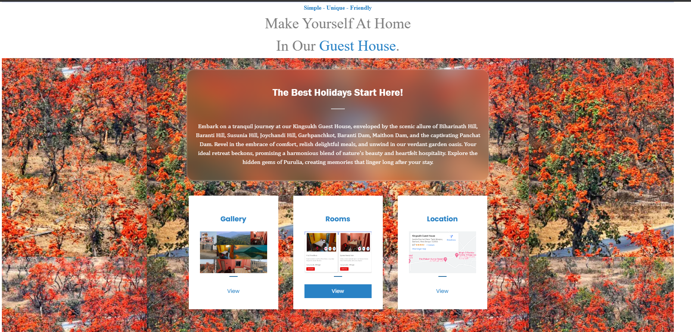
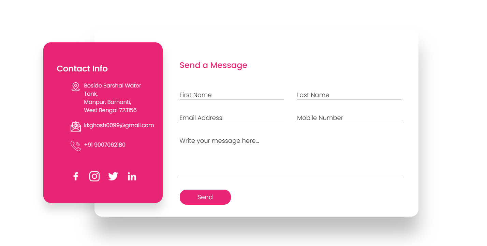
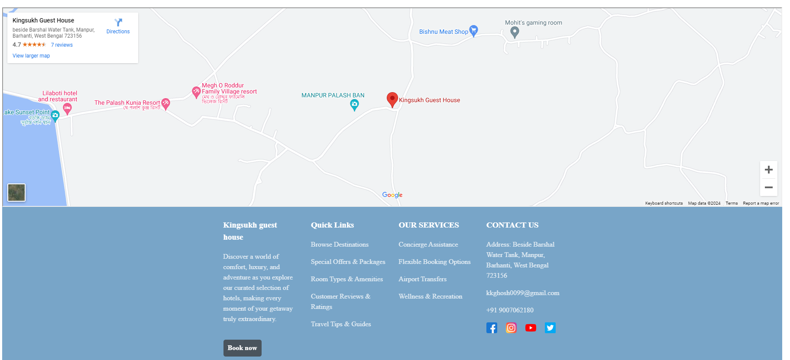
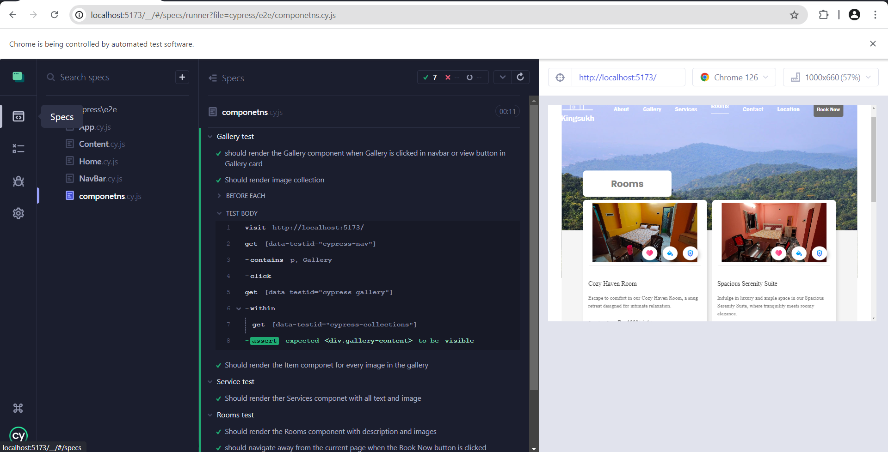

# KINGSUKH Room booking (frontend )


## Visit the live sites given below for demo
### * LIVE [Netlify](https://react-room-booking.netlify.app/)   => https://react-room-booking.netlify.app/

## Introduction
Redesign the exisƟng website of King Sukh Guest House (hƩps://www.kingsukhguesthouse.com/) to

enhance its design and ensure responsiveness. The goal is to create a visually appealing and user-
friendly website that effecƟvely promotes the guest house's services and aƩracts potenƟal

customers. The redesign will utlize HTML, CSS (preferably with a framework), JavaScript, and may
optionally incorporate React.js or Next.js.

This project consists of three main parts:
  * **Front End:** The user interface for room booking.


## Technologies Used
  * **Frontend:** React, Vite, CSS
  * **Hosting:** Netlify, Vercel


## NOTE: 
 * Make sure to install latest version of  React.js.

## Features:
  * Home Page : Details about the site and its services including Location and contact information.
  * Navigation : User can navigate to different pages or sectin  by clicking on the options in the Navbar.
  * Gallery: User can click and view all images of the rooms.
  * Service: Infromation about the services.
  * Rooms: Get all the information about rooms.
  * Contact: Get all the information about contact and send queries to get the information.
  * Location: Get all the information about.


## Installation:
 -> Follow the below steps
 
  **1.Clone the repository:**
  ```bash
  git clone https://github.com/Tosif145/room-booking.git
  cd room-booking
  ```

  **2.Install Dependencies:** change directory to the respective section and use the below command.
  ```bash
   npm install
  ```

   **3.Run the Application:** change directory to the respective section and use the below command in  terminals.
   ```bash
   cd room-booking
   npm run dev
   ```
  **4.Testing:** Follow the below steps to complete E2E testing.
   ```bash
   cd room-booking
   npx cypress open
   ```
   
   * Open a new terminal and run the "npx cypress open" command.
   * After running the command u will get an interface with two selective options.
   * Select E2E Testing to test the whole application.
   * Select the browser and start testing.
   * Under specs section u will see 5 different testing files with extension ".cy.js".
   * Run each and every file to test and see the visual results.
   * Add other testing files based on your requirements.

   * You can see those test files in "cypress" folder of the project.


## Snapshots
### App Frontend: 
  * **Home Page :**
    
      


 *  **Contacts:**

      


  *  **Location display:**

      


  *  **Testing application:**

      


 ### For any Queries:
   * mail to : tosifhk2000@gmail.com